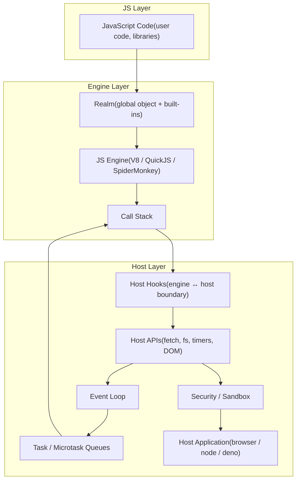
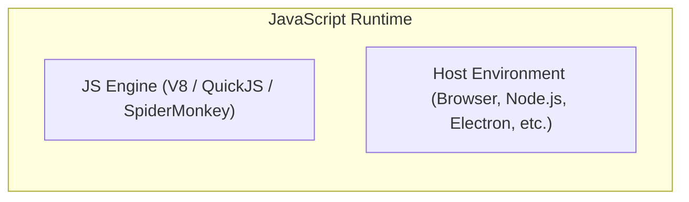

# JS-Deep

**JS-Deep** — a deep guide to JavaScript as an embedded execution layer in various hosts (Node.js, browsers, Electron, databases).  
This resource is aimed at students, developers, and enthusiasts who want to go beyond basic tutorials and understand **JS engines, host interaction, API bindings, and execution context**.

---

## Overview

JavaScript always runs inside a **host** (browser, Node.js, Electron, database).
 **Layers :**
- **JS** – user scripts, functions, variables, libraries
- **Engine** – parsing, JIT compilation, garbage collection (V8, QuickJS, SpiderMonkey)
- **Host** – context, API bindings, sandbox, access to filesystem, network, DOM

---

## Components

| Component | Description | Responsibilities | Does Not Do |
|-----------|-------------|-----------------|-------------|
| JavaScript (JS) | Code, ECMAScript | Logic, computations, calls host API | Access OS, FS, network |
| JS Engine | V8, SpiderMonkey, QuickJS | Parsing, JIT, execution, GC | Provides host API |
| Host | Browser, Node.js, Electron, Database | Context, API, sandbox, control execution | Executes JS by itself |

---

## Runtime (Logical Boundary)

Runtime is a conceptual boundary combining Engine and Host.

JS always runs inside a runtime environment.

## References

- **ECMAScript Specification (ECMA-262)**  
  https://www.ecma-international.org/publications-and-standards/standards/ecma-262/

- **V8 JavaScript Engine**  
  https://v8.dev/

- **QuickJS Engine**  
  https://bellard.org/quickjs/

- **Node.js Official Documentation**  
  https://nodejs.org/

- **MDN JavaScript Guide**  
  https://developer.mozilla.org/en-US/docs/Web/JavaScript/Guide

## Goals

- Provide a clear mental model of **JavaScript as an embedded execution layer**
- Distinguish responsibilities between **JavaScript, the JS Engine, and the Host**
- Explain how **API bindings and native bridges** connect JS to host resources
- Demonstrate simplified **embedding pseudocode examples**
- Encourage deeper exploration of **engine internals and runtime architecture**
